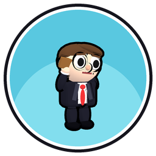
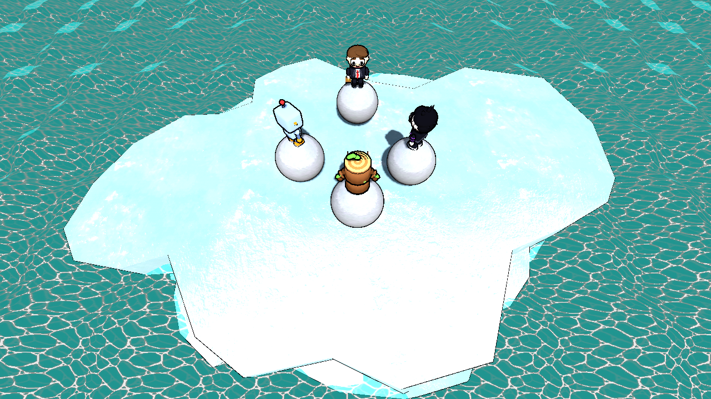

#  Marky Party

[](https://www.gnu.org/licenses/gpl-3.0.html)
[](https://godotengine.org/)

A [free/libre](https://www.gnu.org/philosophy/free-sw.html) and
[open-source](https://opensource.org/docs/osd/) party game that is meant to
replicate the feel of games such as Mario Party.

Marky Party is a fork of [Super Tux Party](https://gitlab.com/SuperTuxParty/SuperTuxParty)
(licensed under the GPL, see below) with its own characters and a new name.



## Running it

All assets are in the repository as normal files (no Git LFS), so a plain clone is enough.
You need [Godot 4.7](https://godotengine.org/) and Python 3:

```sh
git clone -b claude/optimistic-cori-yxc743 https://github.com/obamalama12/GMParty.git
cd GMParty
python tools/first_import.py "C:/path/to/Godot_v4.7-stable_win64.exe"
```

`first_import.py` imports every asset once (about 30 seconds). Then open the folder in Godot
and press F5. In the lobby pick the board "MarkyValley".

## Engine

Marky Party is built with the [Godot Engine](https://godotengine.org/).
Currently, Godot Engine version 4.7 is used.

## Retro look

The 3D picture is drawn with a Nintendo 64 style post-processing shader (`common/retro/`): about 240 lines,
the console's three-point texture filter, 16 bit colour with dithering. The menus and text stay sharp.
The board has distance fog, an old-TV overlay (scanlines, dark corners) sits on top, and the sound is slightly
muffled like a 90s console. Switch the look off under Options > Visual (Retro look, Old TV scanlines).

## Tools

`tools/` has helpers for development:

- `tools/minigame_playthrough` plays every minigame once and takes screenshots.
- `tools/character_builder` builds the characters in Blender and renders previews.
- `tools/board_builder` generates the Marky Valley board, `tools/board_tour` takes screenshots of boards.
- `tools/first_import.py` imports the assets on a fresh clone (see above). `tools/get_assets.py` re-copies assets from an upstream checkout.

## Issues

If you have ideas for mini-games, design improvements or have found a bug then
please report that under Issues.

## License

All code is licensed under the [GNU GPL V3.0](https://www.gnu.org/licenses/gpl.html) or, at your option, any later version.
See the [**LICENSE**](licenses/LICENSE) file for more information.

All other data such as art, sound, music, and etc. is released under a bunch
of different licenses.
See the [**LICENSE-ART**](licenses/LICENSE-ART.md) file, the [**LICENSE-MUSIC**](licenses/LICENSE-MUSIC.md) file, the [**LICENSE-SHADER**](licenses/LICENSE-SHADER.md) file and the [**LICENSE-FONTS**](licenses/LICENSE-FONTS.md) file for more details.

## Credits

Based on [Super Tux Party](https://gitlab.com/SuperTuxParty/SuperTuxParty) by its contributors.
